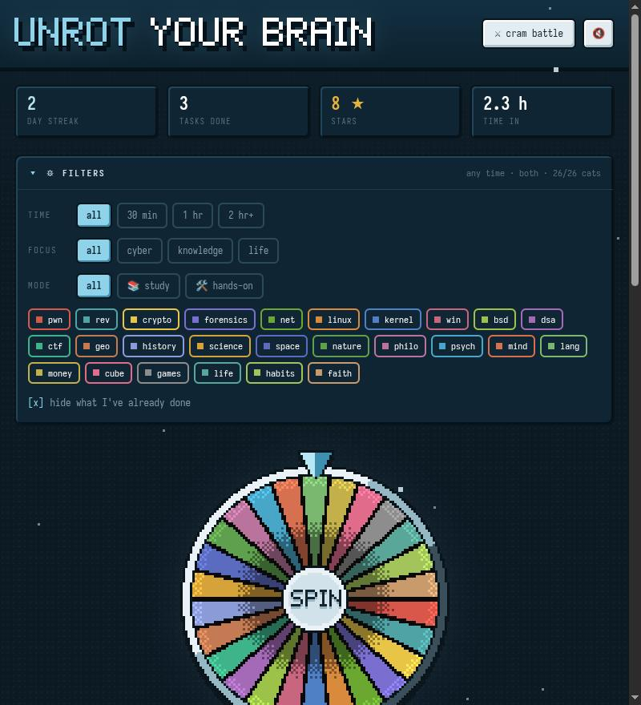
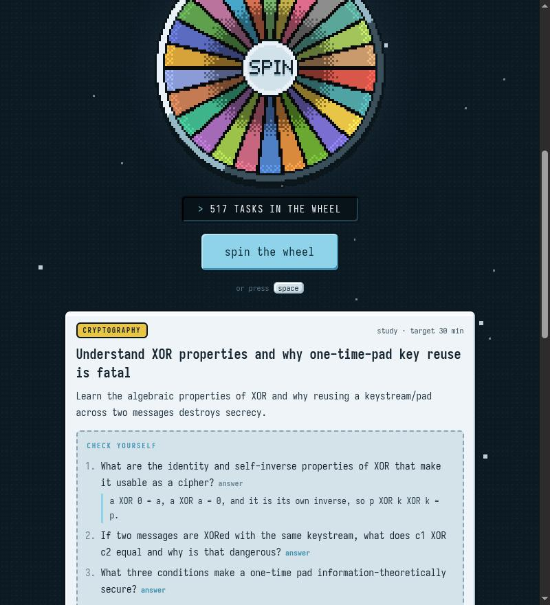
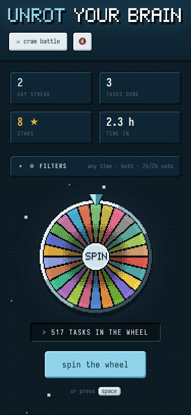

# unrot your brain

Spin a wheel, get one real thing to learn or do, log it. A snowy, pixel-art
kick in the pants to stop doom-scrolling. Live at <https://mokosak.github.io>.



Every task ends with a check: three questions to answer from memory (with
hidden answers) for study tasks, or three things that must work for hands-on
ones. 520 hand-written tasks across 26 categories, from binary exploitation
to rook endgames to the Cuban Missile Crisis.



Progress, streaks and cram-battle standings live in your browser's
localStorage; nothing leaves the page. No accounts, no cloud, no tracking.

<p align="center"></p>

## files

| file | what |
|------|------|
| `index.html`, `style.css`, `app.js` | the whole site, no build step, no dependencies |
| `skills.json` | every task, generated from `content/` |
| `content/<category>.json` | the tasks, one file per wheel category |
| `tools/build-skills.py` | checks `content/` and writes `skills.json` |
| `docs/` | screenshots for this README |

## adding or editing tasks

Edit `content/<category>.json`, then:

```sh
python3 tools/build-skills.py
```

It rejects entries without exactly three checks (and three answers for study
tasks). Add new tasks at the end of a file: ids come from the position, so
appending keeps everyone's progress pointing at the right tasks.

Preview locally with `python3 -m http.server` and open <http://localhost:8000>.
